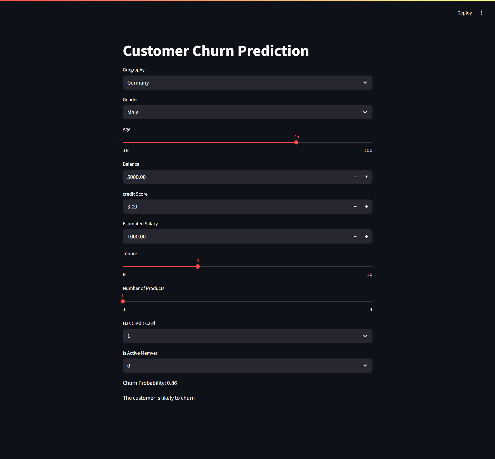

# 🔮 Customer Churn Prediction App

A full pipeline for predicting **bank customer churn** using a **deep learning model** built with **TensorFlow**. The project includes both a **model training notebook** and a **Streamlit web app** for real-time predictions. The model learns from customer data to forecast churn behavior using various account and demographic features.

---

## 🚀 Features

- 🔧 Train own model using historical customer data (`ann_main.ipynb`)
- 🤖 Predicts churn probability in real time with a saved model
- 📊 Accepts inputs like gender, age, credit score, geography, salary, etc.
- 🧠 Encodes categorical variables with **LabelEncoder** and **OneHotEncoder**
- 🔄 Scales features with **StandardScaler**
- 💾 Saves all preprocessing tools and the trained model using `pickle` and `.h5` format
- 🌐 Simple, fast UI using Streamlit

---

## 🛠️ Tech Stack


---

## 🧠 Model Training

Model training is done in the file: **`ann_main.ipynb`**

It includes:
- Importing and preprocessing the dataset
- Encoding:
  - `LabelEncoder` for Gender
  - `OneHotEncoder` for Geography
- Feature Scaling using `StandardScaler`
- Building an **Artificial Neural Network (ANN)** using `TensorFlow`
- Evaluating and saving:
  - Trained model (`model.h5`)
  - Encoders (`label_encoder_gender.pkl`, `onehot_encoder.pkl`)
  - Scaler (`scaler.pkl`)

---

## 🌐 Streamlit App

The `app.py` file loads the saved model and preprocessing tools to:
- Collect user input via form
- Encode and scale input
- Predict churn probability
- Display results interactively

---

## 📸 Demo



---

## ⚙️ Setup Instructions

### ✅ Prerequisites

- Python 3.10
- TensorFlow (v2.11+ recommended)
- All required files from training phase:
  - `model.h5`
  - `label_encoder_gender.pkl`
  - `onehot_encoder.pkl`
  - `scaler.pkl`

### 📦 Install Dependencies

```bash
pip install -r requirements.txt

streamlit run app.py