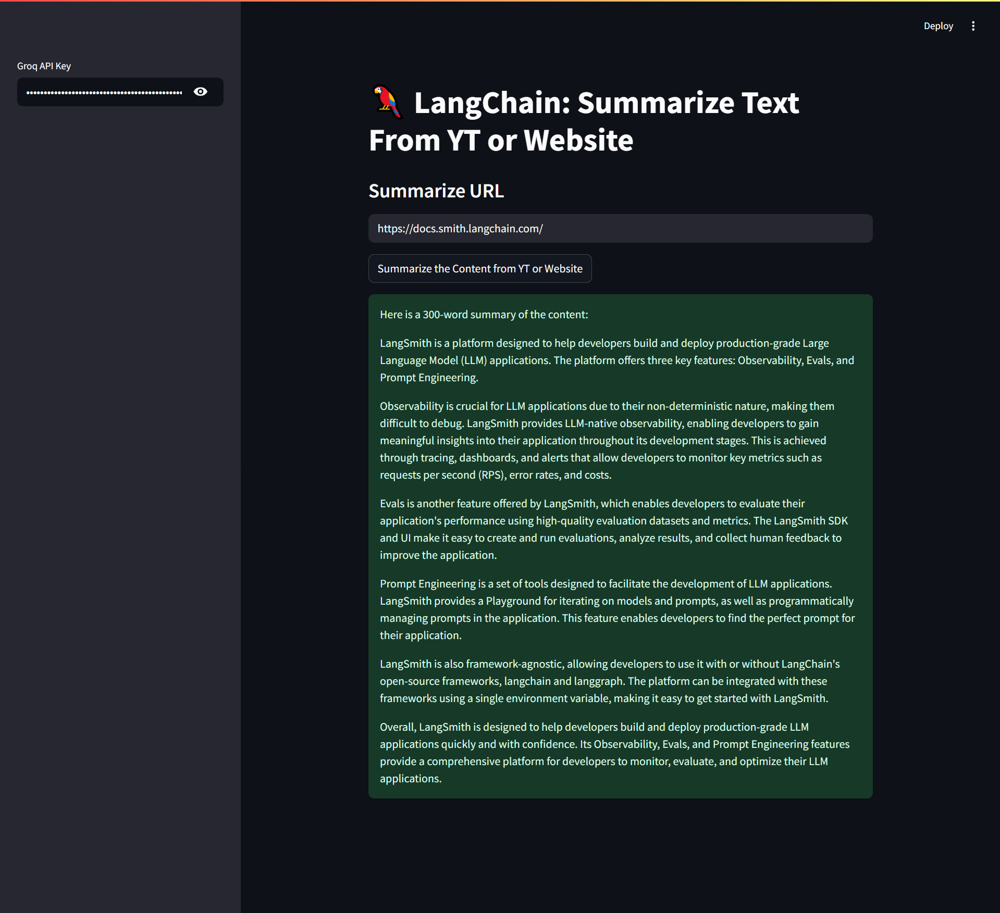

# 🦜 LangChain URL Summarizer

A **Streamlit** app that summarizes content from **YouTube videos** or **web pages** using **LangChain** and **Groq’s Llama 3.1** LLM. Ideal for quickly understanding long videos or lengthy articles with a click!

---

## 🚀 Features

- 🔗 Accepts any valid YouTube or website URL
- 🤖 Summarizes the content using **Llama-3.1-8b-instant** via Groq API
- 🧠 Uses LangChain's `load_summarize_chain` for effective summarization
- ⚡ Simple, fast, and user-friendly Streamlit interface
- ✅ Validates URL before processing

---

## 🛠️ Tech Stack


---

## 📸 Demo



---

## ⚙️ Setup Instructions

### ✅ Prerequisites

- Python 3.10+
- Groq API Key (get from [console.groq.com](https://console.groq.com/))

### 📦 Install Dependencies

```bash
pip install -r requirements.txt

streamlit run app.py
