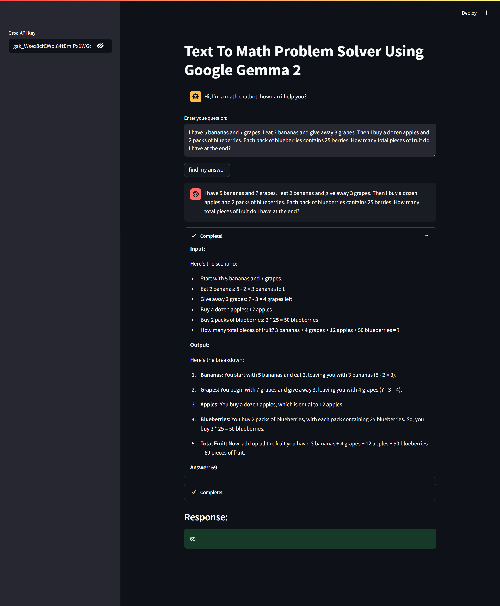

# 🧮 LangChain Math Problem Solver

A **Streamlit** app that solves math word problems and retrieves factual data using **LangChain** and **Groq’s Gemma 2** LLM. Designed to help with arithmetic, logical reasoning, and real-time Wikipedia lookups — all from plain text.

---

## 🚀 Features

- 🔢 Solves real-world and complex math word problems
- 🧠 Provides step-by-step reasoning and final answers
- 🔍 Retrieves factual data from Wikipedia using search queries
- 🤖 Uses **Gemma2-9b-It** model via Groq API
- 🧰 Powered by LangChain agents, tools, and chains
- 💬 Chat-like memory with user interaction history

---

## 🛠️ Tech Stack


---

## 📸 Demo



---

## ⚙️ Setup Instructions

### ✅ Prerequisites

- Python 3.10+
- Groq API Key (available at [console.groq.com](https://console.groq.com/))

### 📦 Install Dependencies

```bash
pip install -r requirements.txt

streamlit run app.py