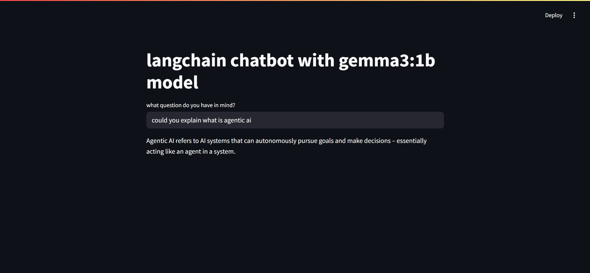

# Generative AI Chat App with Gemma 3:1b (Enhanced)


An enhanced generative AI chatbot using the `Gemma 3:1b` model through Ollama, powered by LangChain and Streamlit. This version introduces function-based response generation and improved prompt chaining.

---

## ✨ Features

- 💬 Interactive web-based chat interface
- ⚙️ Modular `generate_res()` function for flexible reuse
- 🤖 Local inference using Ollama’s `gemma3:1b` model
- ⛓️ LangChain integration for prompt chaining and parsing
- 🔐 Environment-based configuration for LangSmith tracing

---

## 🛠️ Prerequisites

Before running the app, make sure you have:

1. Python 3.10+
2. [Ollama](https://ollama.com/) installed and running locally
3. Gemma 3:1b model pulled via Ollama (run `ollama run gemma:3b`)
4. A `.env` file with optional LangSmith config:
   ```env
   LANGSMITH_API_KEY=your_langsmith_api_key
   LANGSMITH_PROJECT=your_project_name


## 📸 Demo


## Installation

1. Clone the repository:
```bash
git clone https://github.com/ahmedosm0/NLP_GenAI.git

2. Install dependencies:
pip install -r requirements.txt

3. Run the application with:
streamlit run app.py
