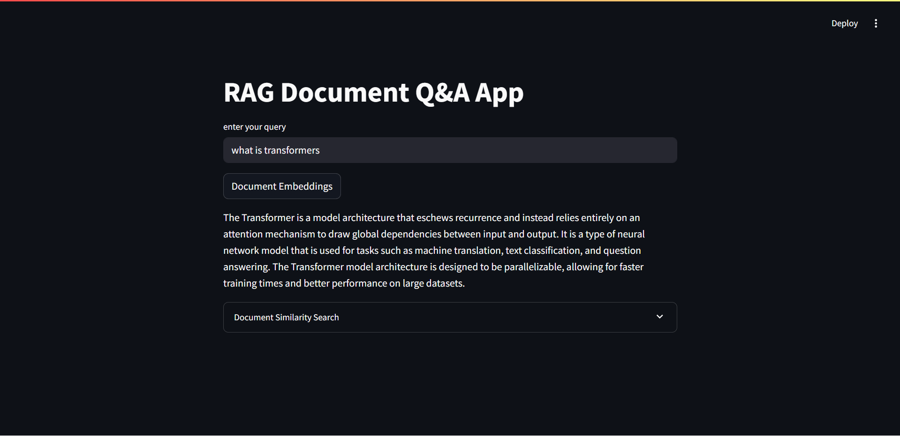

# 📄 RAG Document Q&A App with LLaMA 3 + FAISS + HuggingFace


A Retrieval-Augmented Generation (RAG) web app using **LangChain**, **FAISS**, **HuggingFace Embeddings**, and **Groq's LLaMA 3.1 (8B Instant)** model. Users can upload and query documents like PDFs, and get highly relevant, LLM-generated answers.

---

## ✅ Features

- 📄 PDF ingestion and intelligent splitting
- 🔍 FAISS-based vector similarity search
- 🧠 HuggingFace sentence embeddings (`MiniLM`)
- 🤖 Fast LLM responses using `llama-3.1-8b-instant` on **Groq**
- ⛓️ End-to-end RAG pipeline via LangChain
- 🖥️ Simple and clean Streamlit interface

---

## 🛠️ Prerequisites

Before running the app, make sure you have:

1. Python 3.10+
2. [Groq API key](https://console.groq.com/)
3. [Hugging Face token](https://huggingface.co/settings/tokens)
4. A sample document at:  
   `../1.imp_modules/attention.pdf` (or adjust path accordingly)

---
## 📸 Demo


## 📦 Installation

### 1. Clone the Repository

```bash
git clone https://github.com/ahmedosm0/NLP_GenAI.git

2. Install dependencies:
pip install -r requirements.txt

3. Run the application with:
streamlit run app.py
