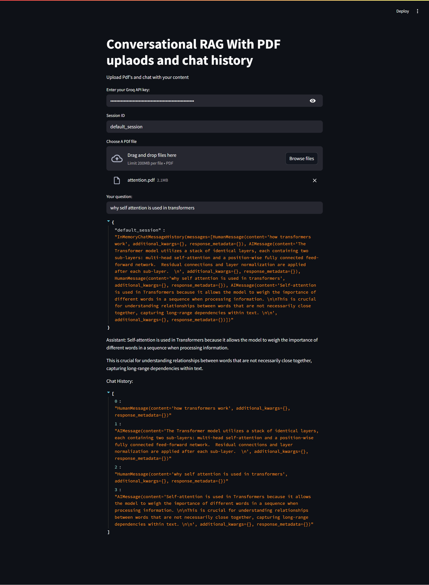

# 💬 Conversational RAG with PDF Uploads & Chat History


An advanced **Conversational RAG (Retrieval-Augmented Generation)** application powered by **LangChain**, **Groq LLM**, **Chroma**, and **HuggingFace embeddings**. This app lets you upload multiple PDFs, interact with them using natural language, and maintain **session-aware chat history**.

---

## ✅ Features

- 📄 Upload and process multiple PDF files
- 🧠 Conversation-aware question rewriting (contextualization)
- 🧾 Persistent per-session chat history using `ChatMessageHistory`
- 🧠 Uses `Gemma2-9b-It` model via Groq API for fast response generation
- 📚 FAISS-style document retrieval using `Chroma` and `MiniLM` embeddings
- 💬 RAG chain using LangChain's advanced chaining utilities

---

## 🛠️ Prerequisites

- Python 3.10+
- A valid [Groq API key](https://console.groq.com/)
- A [Hugging Face access token](https://huggingface.co/settings/tokens)
- Streamlit and LangChain dependencies

---
## 📸 Demo


## 📦 Installation

### 1. Clone the Repository

```bash
git clone https://github.com/ahmedosm0/NLP_GenAI.git

2. Install dependencies:
pip install -r requirements.txt

3. Run the application with:
streamlit run app.py