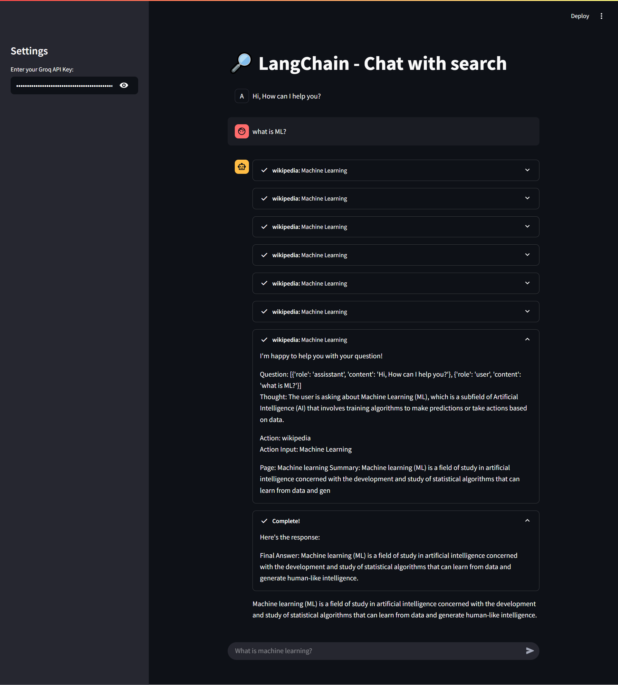

# 🔎 LangChain Search Chat Agent with Groq

A Streamlit-based conversational AI app that integrates **Groq's LLM** with **LangChain tools** (Wikipedia, Arxiv, DuckDuckGo) to provide real-time, contextual responses to user queries using a tool-augmented agent.

---

## 🧠 Features

- 💬 Interactive chat interface using `streamlit`
- 🔍 Real-time search from **Wikipedia**, **Arxiv**, and **DuckDuckGo**
- 🧩 Powered by `LangChain` agent with `ZERO_SHOT_REACT_DESCRIPTION`
- ⚡ Uses `Groq`'s blazing-fast LLMs (e.g. `Llama3-8b-8192`)
- 🧠 Memory-enabled chat using `st.session_state`

---

## 📦 Tech Stack


---

## 🚀 Demo



>
---

## 🛠️ Installation

### 🔧 Prerequisites
- Python 3.10+
- [Groq API Key](https://console.groq.com/)

### 📦 Install dependencies
```bash
pip install -r requirements.txt

streamlit run app.py

