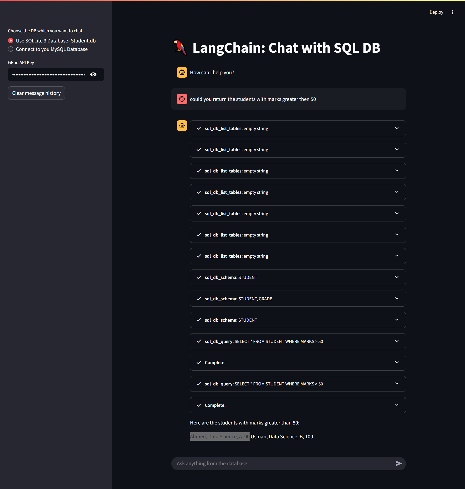

# 🦜 LangChain SQL Chat Agent

A Streamlit app that allows users to **chat with a SQL database** using **LangChain**, powered by **Groq's LLM**. This app supports both **SQLite** (local `.db` file) and **MySQL** database connections.

---

## 🚀 Features

- 🔌 Connect to **SQLite3** or your own **MySQL** database
- 💬 Natural language queries to extract data from your DB
- 🤖 Uses **LangChain SQL Agent** with `ZERO_SHOT_REACT_DESCRIPTION`
- ⚡ Powered by **Groq’s Llama3-8b-8192** LLM for fast, intelligent responses
- 💡 Built-in chat memory and `StreamlitCallbackHandler` for live interactions

---

## 🛠️ Tech Stack


---

## 📸 Demo



---

## ⚙️ Setup Instructions

### ✅ Prerequisites

- Python 3.10+
- `Groq` API Key from [console.groq.com](https://console.groq.com/)
- SQLite `.db` file (default: `student.db`) or MySQL database credentials

### 📦 Install Dependencies

```bash
pip install -r requirements.txt

streamlit run app.py
